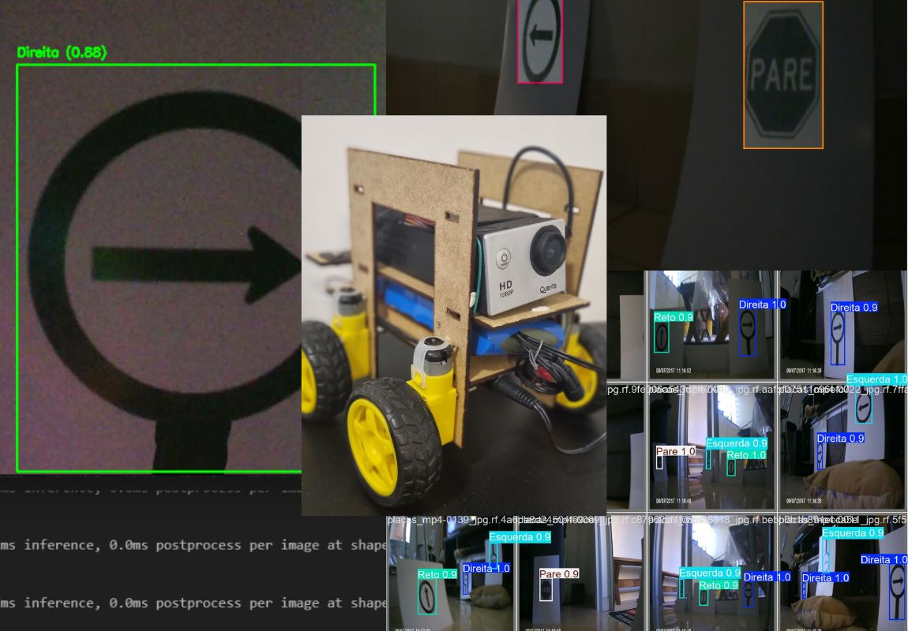
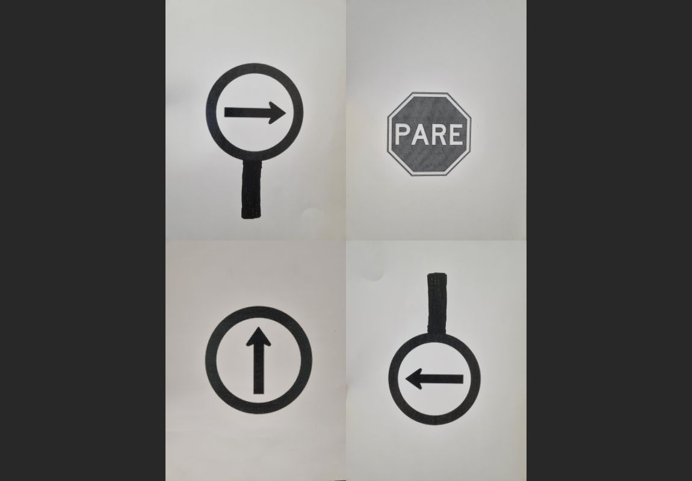
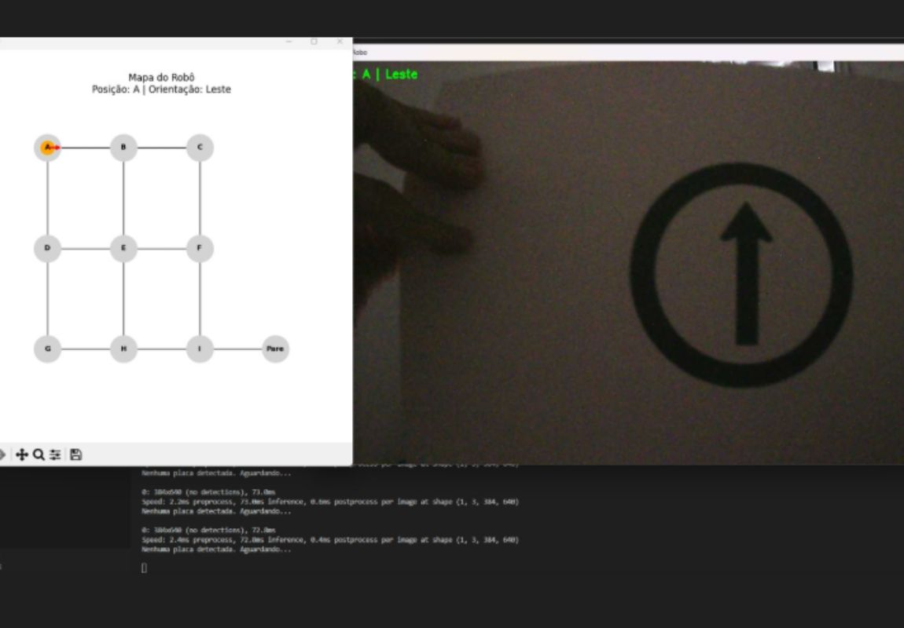

# Definição de Trajetória Robótica Usando Visão Computacional

**Trabalho de Conclusão de Curso (TCC)**  
**Curso Superior de Tecnologia em Análise e Desenvolvimento de Sistemas**  
**Instituto Federal de Educação, Ciência e Tecnologia de São Paulo (IFSP) - Campus Campinas**
#

## 💡 Ideia Principal

Este projeto desenvolveu uma alternativa para a **navegabilidade autônoma** em um sistema robótico a base do computador SBC **Asus Tinkerboard**. Por meio da **detecção de placas** de sinalização visuais, o robô é capaz de interpretar o ambiente e tomar decisões. A decisão sobre o trajeto é feita com base em algoritmos da Teoria dos Grafos, mais especificamente o algoritmo de **Dijkstra**.

## 🛠️ Etapas de Desenvolvimento

- Impressão dos marcadores visuais (placas);
- Coleta de imagens reais com a câmera do robô;
- Criação e anotação do dataset;
- Treinamento do modelo com YOLOv8;
- Integração do modelo ao sistema robótico com Python;
- Aplicação do algoritmo de Dijkstra para cálculo do caminho ótimo;
- Testes em diversos cenários.

## 🧠 Treinamento

O treinamento foi realizado com **YOLOv8**, com os seguintes parâmetros:

- 50 épocas (epochs);
- Resolução: 640x640;
- Dataset personalizado com 4 classes: "Direita", "Esquerda", "Reto" e "Pare".

O modelo final gerado está salvo no arquivo [best.pt](Códigos/best.pt).

> ⚠️ **Aviso**: para utilizar esse modelo e obter os mesmos resultados, é necessário usar os **mesmos marcadores visuais (imagens)** do dataset original. Impressões em cores e tamanhos diferentes podem afetar o comportamento do modelo!

As placas foram impressas em **papel A4**, em **preto e branco**, os marcadores ocupam aproximadamente **10cm x 8cm** da folha.

## 🥹 Deseja treinar seu próprio modelo?

Você pode seguir os mesmos passos que eu:

- O dataset foi criado com o site [Roboflow](https://universe.roboflow.com/). Isso depois de gravar um video de cerca de 1m30s passando pelos modelos visuais em diversos ângulos. Foram utilizados 5 papeis para cada classe, distribuidos aleatoriamente pelo ambiente.
- Repertório auxiliar para treinamento com YOLOv8 em português: [treinar_yolov8](https://github.com/ProgramadorArtificial/treinar_yolov8). O repertório me auxiliou a treinar o modelo com o meu dataset próprio.

## 🤓 Códigos

### [main.py](Códigos/main.py) -- Código principal executado no sistema asus tinkerboard
É a versão final do código como utilizamos o Asus Tinkerboard, a biblioteca controladora dos módulos GPIO é a ASUS.GPIO isso deve ser alterado para sistemas diferentes
- Captura o vídeo da câmera em tempo real;
- Realiza detecção das placas com YOLOv8;
- Decide a movimentação do robô com base na placa;
- Controla os motores usando GPIO;
- Calcula o caminho ideal com o algoritmo de Dijkstra.

### [data_test.py](Códigos/data_test.py) -- Código para simulação e Levantamento de Dados
Para facilitar a visualização do modelo e executar em um computador mais potente o arquivo data_test simula exatamente o caminho do robô ao utilizar o tempo como métrica com o algorítmo de Dijkstra assim o código foi utilizado para testar o modelo e levantar dados.
- Permite visualização do caminho real e do "melhor caminho" gerado pelo algorítmo de Dijkstra;
- Simula o caminho do robô com base no tempo como métrica de distância;
- Avalia o desempenho do sistema em diferentes distâncias, luminosidade e complexidade de rota.

## 🤓 O que está acontecendo??

O código que desenvolvi cria um mapa baseado em um grafo como utilizei letras do alfabeto o limite seria 26 vértices no mapa. A distância entre cada vértice pode ser definida no código. Ao detectar uma das placas (direita, esuerda, reto ou pare). o robô assume um comportamento. Além disso o sistema informa o caminho mais curto graças ao algorítmo de Dijkstra, ainda é possível seguir por outros caminhos, assim, o sistema simplesmente calcula um novo caminho mais curto e informa.

## 🤯 Eficiência

O computador Asus Tinkerboard possue sim suas limitações, tive alguns problemas com isso durante o desenvolvimento. O programa como esperado acabou ficando muito pesado para o sistema compilar e para isso a necessidade de um programa simulador, assim, facilitando os testes do modelo. Certamente existe melhores opções de SBC's (single board computers) para essa tarefa, mas os preços não ajudam nosso estudo 😒.

## 📄 Recursos

* **Monografia** - veja o trabalho completo: [Clique aqui para acessar a monografia](Entregas/TCC.pdf)
* **Códigos** - os códigos completos do modelos estão disponíveis: [Códigos](Códigos)
* **imagens** - entenda melhor como eu fiz o modelo observando as imagens na pasta: [Imagens](Imagens)

## 🫡 Quer testar meu modelo?

Você irá precisar de python e instalar as bibliotecas necessárias (veja no código que for utilizar) se tiver um computador Asus Tinkerboard o [main.py](Códigos/main.py) deve funcionar se não ainda poderá testar o [data_test.py](Códigos/data_test.py). Ambos necessitam de uma câmera conectada ao computador pode ser necessário mudar o index da câmera no código. ⚠️ sistemas diferentes podem ter resultados diferentes.
- Baixe o arquivo [best.pt](Códigos/best.pt) ele possue os dados do meu treinamento.
- Imprima as imagens dos marcadores visuais que utilizei e teste.

## 👥 Autores
* **Lucas da Silva Carvalho** - Aluno
* **Prof. Dr. Glauber da Rocha Balthazar** - Professor Orientador
